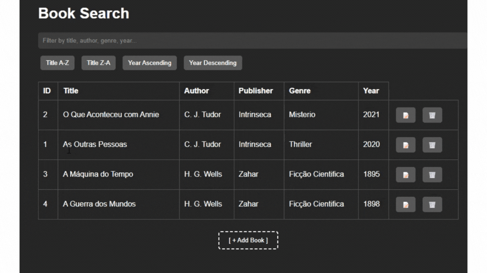
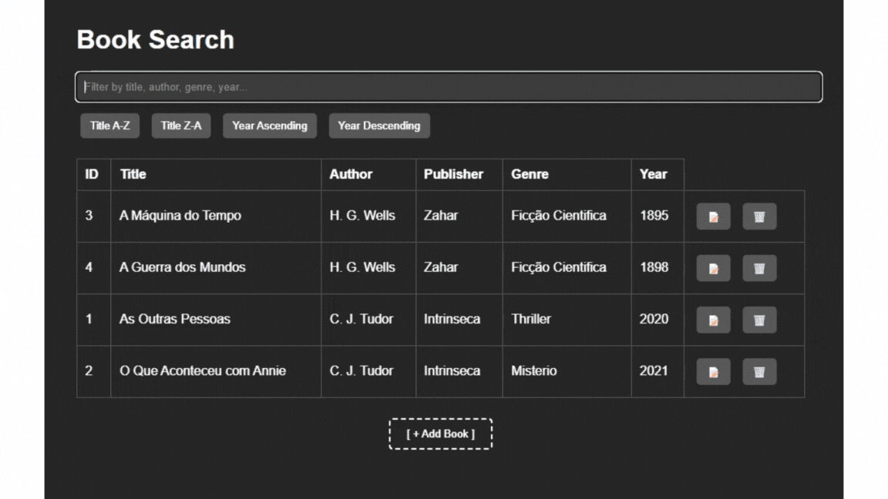

# 📚 Bibliotech

Bibliotech is a simple yet functional **Book Management System**, created with **FastAPI (backend)** and **HTML/CSS/JS (frontend)**. It allows users to add, edit, delete, sort, and filter books in a local or remote database.

---

## 🚀 Features

- Add, edit, and delete books.
- Sort books by title or year of publication.
- Filter/search by title, author, genre, publisher, or publication year.
- Responsive and intuitive frontend.
- Integration with online REST API (FastAPI + PostgreSQL)

---

## 🎥 Preview

### 🔍 Sorting & Filtering

### ✏️ Adding, Editing, and Deleting

---

## 🧩 Tech Stack

- **Frontend**: HTML5, CSS3, JavaScript (Fetch API)
- **Backend**: FastAPI (Python)
- **Database**: PostgreSQL (online) or SQLite (local, for development)

---

### Test Online
https://wilcleyber.github.io/BiblioTech_Frontend/
⚠️ Note: The API may take around 30 seconds to start when accessed.

---

## 📄 License

Project for study and portfolio purposes. Feel free to contribute!

